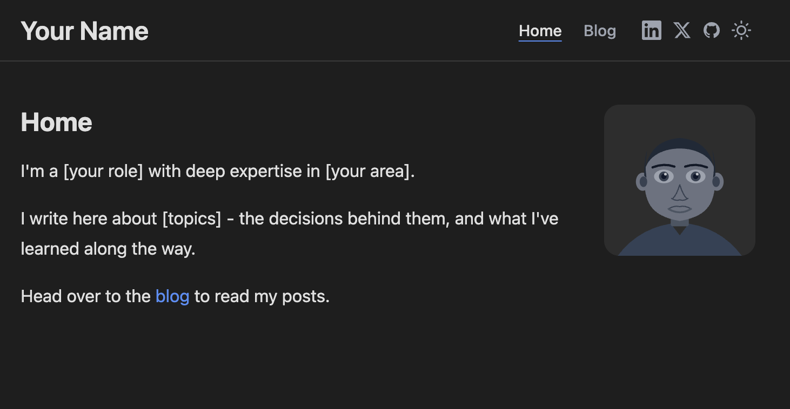
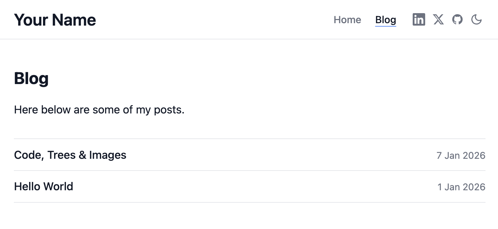

# MarkMatter

A lightweight, file-based PHP content engine for building SEO-optimized websites using markdown and front matter.

No framework, no database — just PHP, Markdown, and a single CSS file. Pages are generated with SEO best practices built in: `<title>`, meta description, Open Graph tags, canonical URL, RSS autodiscovery, XML sitemap, and `robots.txt` — all driven from front matter in your Markdown files.

## Screenshots

| Dark mode | Light mode |
| --------- | ---------- |
|  |  |

## Requirements

- PHP 8.5+
- Composer

Install both via [Homebrew](https://brew.sh) if not already present:

```bash
brew install php composer
```

## Dependencies

Two Composer packages, no others:

| Package                                                                   | Purpose                                                           |
| ------------------------------------------------------------------------- | ----------------------------------------------------------------- |
| [`league/commonmark`](https://commonmark.thephpleague.com)                | Converts Markdown to HTML (CommonMark + GitHub Flavored Markdown) |
| [`spatie/yaml-front-matter`](https://github.com/spatie/yaml-front-matter) | Parses YAML front matter from Markdown files                       |

The stack in full:

| Layer   | Technology                         |
| ------- | ---------------------------------- |
| Backend | PHP                                |
| Content | Markdown (YAML front matter + body) |
| Styles  | CSS (single file, no framework)    |

## Setup

```bash
# 1. Install PHP dependencies
composer install

# 2. (Optional) Override config for local dev
#    Create a .env file in the project root:
echo "SITE_URL=http://localhost:8080" > .env
```

## Running locally

### Option A — PHP built-in server (simplest)

```bash
php -S localhost:8080 -t public/
```

Visit http://localhost:8080

### Option B — nginx + php-fpm

Install and start services:

```bash
brew install nginx php
brew services start php
brew services start nginx
```

Create an nginx server block. Save the file below to `/opt/homebrew/etc/nginx/servers/markMatter.conf` (replace the `root` path with your actual project path):

```nginx
server {
    listen 8080;
    server_name localhost;

    root /path/to/MarkMatter/public;
    index index.php;

    location / {
        try_files $uri $uri/ /index.php?$query_string;
    }

    location ~ \.php$ {
        try_files $uri =404;
        fastcgi_pass 127.0.0.1:9000;
        fastcgi_param SCRIPT_FILENAME $document_root$fastcgi_script_name;
        include fastcgi_params;
    }

    # Block direct access to source directories
    location ~ ^/(src|templates|content|composer) {
        return 404;
    }
}
```

Then reload nginx:

```bash
brew services restart nginx
```

Visit http://localhost:8080

> **Note:** On Apple Silicon Macs the php-fpm socket is `127.0.0.1:9000` by default.
> Run `php-fpm --nodaemonize --fpm-config /opt/homebrew/etc/php/8.5/php-fpm.conf` if unsure,
> or check `brew info php` for the socket path.

## Configuration

Edit `content/config.md`:

```yaml
---
# App
# SITE_URL: full URL of your site, used for canonical links, OG tags, sitemap, and RSS feed.
# SITE_NAME: displayed as the nav logo and in browser tab titles.
SITE_URL: http://localhost:8080
SITE_NAME: Your Name

# Portfolio image shown at the top-right of the Home page (text wraps around it).
# Use a path like /assets/images/avatar.svg or an absolute URL.
# Leave blank to hide the portfolio image.
PORTFOLIO_IMAGE: /assets/images/avatar.svg

# Default color theme for first-time visitors.
# Accepted values: light | dark
# Once a visitor clicks the toggle their choice is saved in the browser and
# takes priority over this setting on all future visits.
THEME: light

# Number of posts shown per page on /blog, /category/*, and /tag/* pages.
POSTS_PER_PAGE: 10

# Social links — icons appear in the nav in the order listed here.
# Leave a value blank or remove the line entirely to hide that icon.
SOCIAL_LINKEDIN: https://linkedin.com/in/yourhandle
SOCIAL_TWITTER: https://twitter.com/yourhandle
SOCIAL_GITHUB: https://github.com/yourhandle
---
```

## Content

- **Homepage** — `content/home/README.md`
- **Blog page** — `content/posts/README.md`
- **Posts** — `content/posts/{slug}/README.md`
- **Post images** — `content/posts/{slug}/images/` (served via `/blog/{slug}/images/{file}`)

## Adding a post

Each content file has two sections separated by `---`:

- **YAML front matter** (between the `---` delimiters) - defines HTML `<head>` metadata: the browser tab title, search-engine description, Open Graph tags, and post attributes like date, category, and tags.
- **Markdown body** (everything after the closing `---`) - constructs the visible page content rendered as HTML.

1. Create `content/posts/{slug}/README.md`
2. Fill in the front matter fields
3. Optionally add `category` (single string) and `tags` (YAML list)
4. Write the post body in Markdown below the `---` delimiter

```yaml
---
title: "My Post"
slug: my-post
date_created: 2026-01-01
category: tutorial
tags: [php, markdown]
seo_title: "My Post"          # → HTML <title> and og:title
seo_description: "A short description."  # → HTML meta description and og:description
---

Your post content goes here, written in Markdown.
```

The post appears automatically on `/blog`. The category and each tag become clickable links in the post header, pointing to filtered listing pages.

### Adding images to a post

1. Place image files in `content/posts/{slug}/images/`
2. Reference them in Markdown using the URL `/blog/{slug}/images/{filename}`

```markdown

```

Supported formats: `jpg`, `jpeg`, `png`, `gif`, `webp`, `svg`. Images are served through PHP — no files need to be in `public/`.

## Routes

| URL                | Page                         |
| ------------------ | ---------------------------- |
| `/`                | Homepage                     |
| `/blog`            | Blog - all posts             |
| `/blog/{slug}`     | Single post                  |
| `/blog/{slug}/images/{file}` | Post image file    |
| `/category/{slug}` | Posts filtered by category   |
| `/tag/{slug}`      | Posts filtered by tag        |
| `/robots.txt`      | Robots file with sitemap URL |
| `/rss.xml`         | RSS 2.0 feed                 |
| `/sitemap.xml`     | XML sitemap                  |
| anything else      | 404                          |
